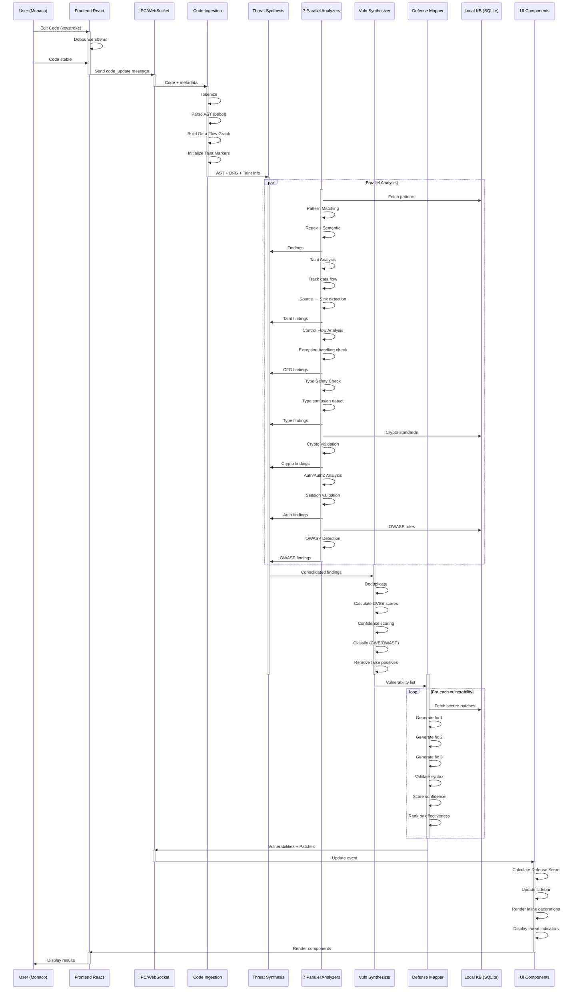
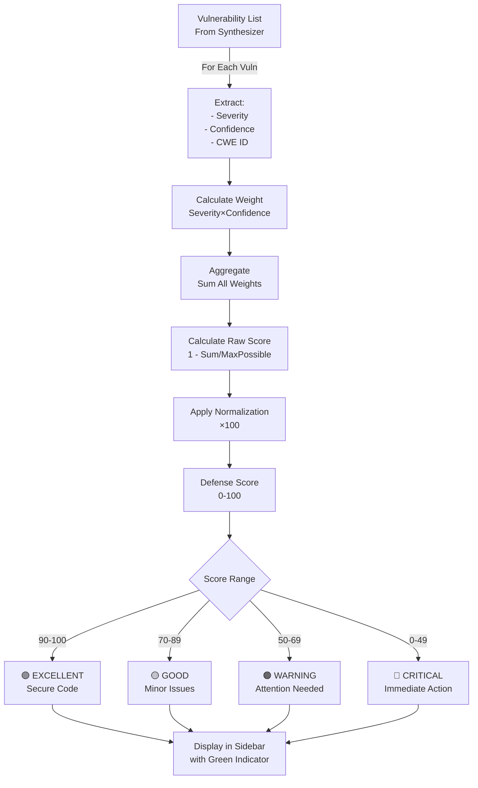
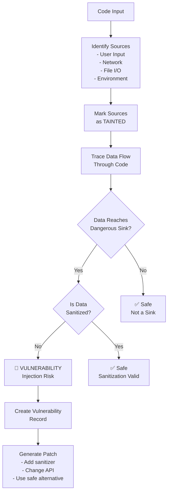
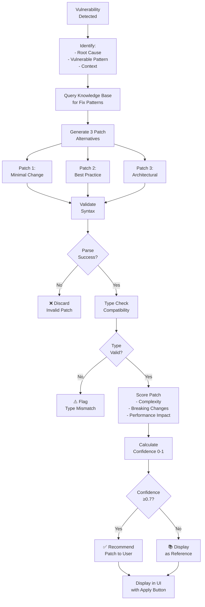
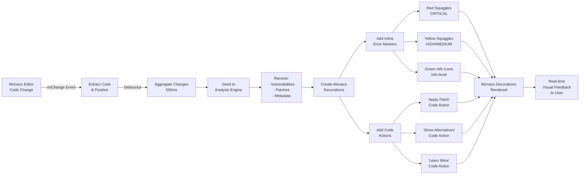
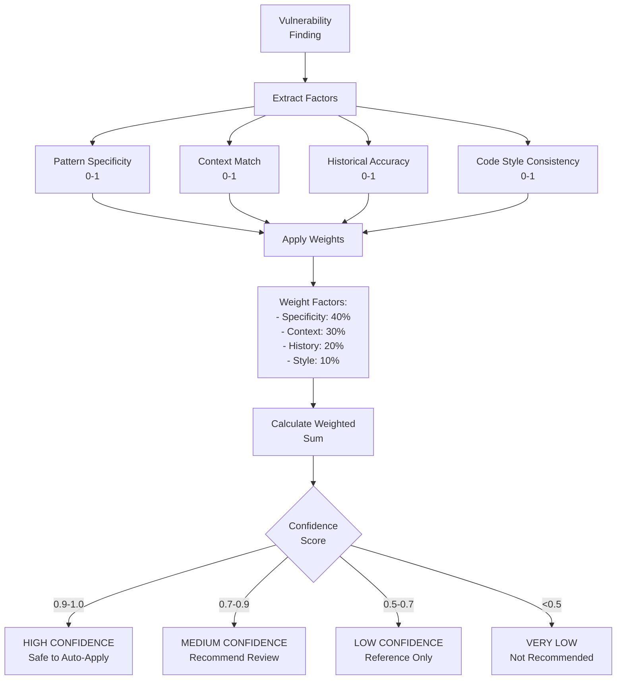
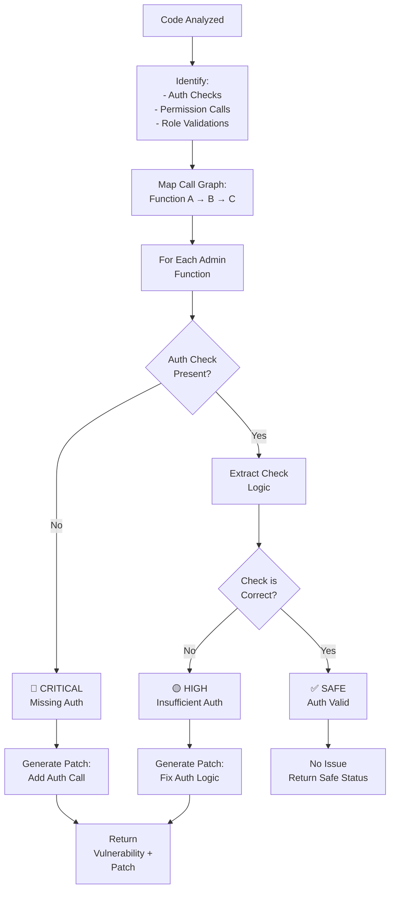
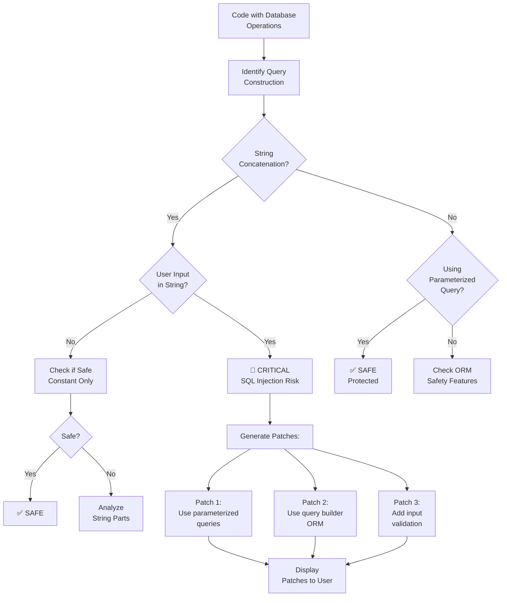
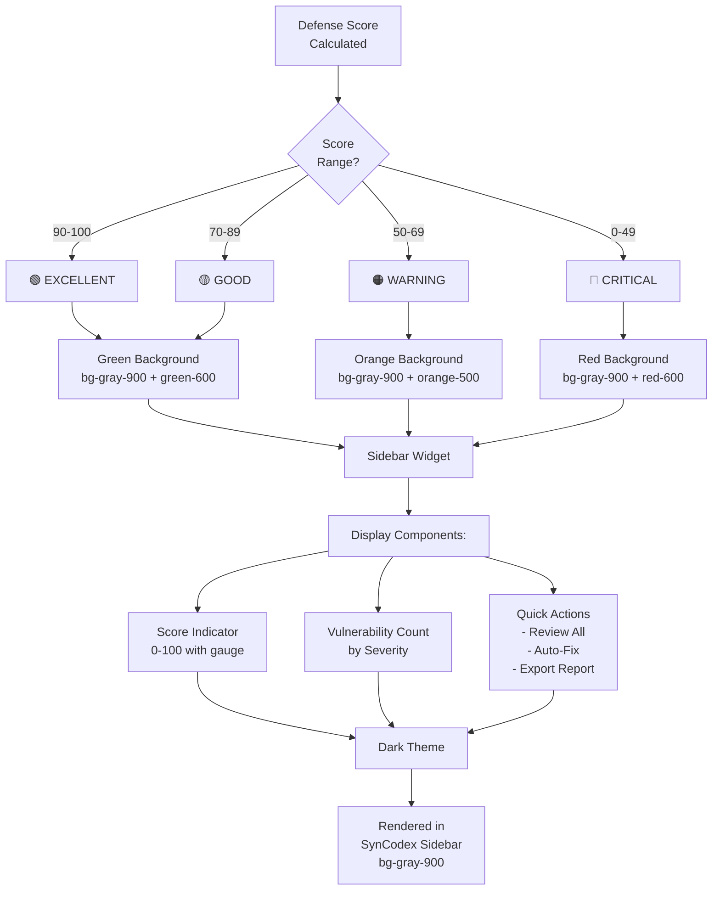

# Bug Synthesis Engine - System Flow Diagrams

## DIAGRAM 1: Real-Time Code Analysis Pipeline (Sequence Diagram)



---

## DIAGRAM 2: Defense Score Calculation Flow



---

## DIAGRAM 3: Taint Analysis Flow (Data Flow Tracking)



---

## DIAGRAM 4: Patch Generation & Validation Flow



---

## DIAGRAM 5: Integration with Monaco Editor



---

## DIAGRAM 6: Confidence Scoring Algorithm



---

## DIAGRAM 7: Authorization & Privilege Flow Detection



---

## DIAGRAM 8: Cryptography Validation Pipeline

```mermaid
graph TD
    A["Code with Crypto<br/>Operations"] --> B["Identify:<br/>- Algorithm Used<br/>- Key Length<br/>- Mode/Padding<br/>- RNG Source"]
    
    B --> C["Query Crypto<br/>Standards DB"]
    
    C --> D{Algorithm<br/>Approved?}
    
    D -->|No| E["🔴 CRITICAL<br/>Weak Algorithm"]
    D -->|Yes| F["Check Key<br/>Length"]
    
    F --> G{Key Length<br/>≥ Min Required?}
    
    G -->|No| H["🟡 HIGH<br/>Weak Key"]
    G -->|Yes| I["Check Mode/<br/>Padding"]
    
    I --> J{Secure Mode?<br/>e.g. GCM, CBC}
    
    J -->|No| K["🟡 HIGH<br/>Insecure Mode"]
    J -->|Yes| L["Check RNG<br/>Quality"]
    
    L --> M{Using<br/>Math.random()?}
    
    M -->|Yes| N["🔴 CRITICAL<br/>Weak RNG"]
    M -->|No| O["✅ SAFE<br/>Crypto Valid"]
    
    E --> P["Generate Patch:<br/>Use approved algo"]
    H --> Q["Generate Patch:<br/>Increase key length"]
    K --> R["Generate Patch:<br/>Change to GCM"]
    N --> S["Generate Patch:<br/>Use crypto.random"]
```

---

## DIAGRAM 9: SQL Injection Detection & Patching



---

## DIAGRAM 10: Sidebar Defense Score Widget



---

## Performance Characteristics

```mermaid
graph LR
    A["1000-line<br/>File"] -->|Code Ingestion<br/>100ms| B["AST + DFG<br/>Built"]
    
    B -->|Parallel Analysis<br/>300ms| C["All 7 Analyzers<br/>Complete"]
    
    C -->|Vulnerability<br/>Synthesis<br/>50ms| D["30-50<br/>Vulns Found"]
    
    D -->|Patch Generation<br/>100ms| E["60-150<br/>Patches Ready"]
    
    E -->|Total: ~550ms| F["Results Sent<br/>to Frontend"]
    
    F -->|UI Rendering<br/><100ms| G["User Sees<br/>Results"]
    
    style A fill:#e1f5ff
    style B fill:#fff3e0
    style C fill:#f3e5f5
    style D fill:#e8f5e9
    style E fill:#fce4ec
    style F fill:#f1f8e9
    style G fill:#e0f2f1
```



