# AI Code-to-Diagram Engine - Architecture Blueprint

## Executive Summary
The **Code-to-Diagram Engine** is a research-level feature for SynCodex that translates active code in the Monaco Editor into real-time visual flowcharts and sequence diagrams. All processing is **client-side only** for privacy compliance, leveraging lightweight Mermaid.js for rendering and a custom AST parser for code analysis.

---

## 1. System Architecture Overview

```
┌─────────────────────────────────────────────────────────────────┐
│                      SynCodex Editor Page                       │
├─────────────────────────────────────────────────────────────────┤
│                                                                 │
│  ┌──────────────────────┐          ┌──────────────────────┐   │
│  │   Monaco Editor      │          │ Diagram Panel        │   │
│  │   (Active Code)      │◄────────►│ (Visual Output)      │   │
│  └──────────────────────┘          └──────────────────────┘   │
│          ▲                                    ▲                │
│          │                                    │                │
│          │ onChange Event                     │                │
│          │                                    │                │
│    ┌─────────────────────────────────────────────┐            │
│    │  Code-to-Diagram Engine (Client-Side)      │            │
│    ├─────────────────────────────────────────────┤            │
│    │                                             │            │
│    │  ┌─────────────────┐  ┌────────────────┐  │            │
│    │  │ Code Parser     │  │ AST Builder    │  │            │
│    │  │ (Lang Detection)│─►│ (Tree Gen)     │  │            │
│    │  └─────────────────┘  └────────────────┘  │            │
│    │         │                      │           │            │
│    │         └──────────┬───────────┘           │            │
│    │                    │                       │            │
│    │    ┌──────────────────────────────┐       │            │
│    │    │ Diagram Generator            │       │            │
│    │    │ (Flowchart/Sequence/State)   │       │            │
│    │    └──────────────────────────────┘       │            │
│    │                    │                       │            │
│    │    ┌──────────────────────────────┐       │            │
│    │    │ Mermaid Renderer             │       │            │
│    │    │ (SVG Output)                 │       │            │
│    │    └──────────────────────────────┘       │            │
│    │                    │                       │            │
│    └────────────────────┼───────────────────────┘            │
│                         │                                    │
│    Diagram Panel ◄──────┘                                    │
│                                                                 │
└─────────────────────────────────────────────────────────────────┘
```

---

## 2. Core Components

### 2.1 **Code Parser & Language Detector**
- **Purpose**: Detect code language and extract meaningful code structure
- **Supported Languages**: JavaScript, TypeScript, Python, Java, Go, Rust, C++
- **Processing**:
  - Language detection via file extension + regex heuristics
  - Tokenization using lightweight regex-based lexer
  - Multi-line comment & string handling
  - Function/class/method extraction

### 2.2 **AST (Abstract Syntax Tree) Builder**
- **Purpose**: Build an intermediate tree representation of code structure
- **Output**: Normalized JSON structure representing:
  - Function definitions with parameters & return types
  - Control flow (if/else, loops, try-catch)
  - Class hierarchies and method calls
  - Data structures (arrays, objects, maps)
  - Call chains and dependencies

### 2.3 **Diagram Generator**
- **Purpose**: Transform AST into diagram directives
- **Diagram Types**:
  - **Flowchart**: Sequential logic, branching, loops
  - **Sequence Diagram**: Function calls, async/await chains, message flow
  - **State Diagram**: State transitions in classes or state machines
  - **Class Diagram**: OOP structure (future enhancement)

### 2.4 **Mermaid Renderer**
- **Purpose**: Render Mermaid directives into interactive SVG
- **Libraries**: 
  - `mermaid.js` (core rendering)
  - `mermaid-cli` (optional server-side optimization)

### 2.5 **Diagram Panel UI**
- **Purpose**: Display and control diagram visibility
- **Features**:
  - Collapsible drawer (left/right side)
  - Real-time update on code change
  - Toggle between diagram types
  - Zoom/pan controls
  - Export as SVG/PNG

---

## 3. Data Flow & System Flow

### 3.1 **Real-Time Update Flow**

```
Code Change Event (Monaco)
         │
         ▼
Debounced Handler (300ms)
         │
         ▼
Language Detection
         │
         ├─ Extract active code block (function/class/main logic)
         │
         ▼
Code Parser
         │
         ├─ Tokenize source code
         ├─ Remove comments & normalize whitespace
         ├─ Extract functions, classes, control flow
         │
         ▼
AST Builder
         │
         ├─ Build normalized tree structure
         ├─ Identify relationships (calls, dependencies)
         ├─ Classify node types (function, condition, loop, etc.)
         │
         ▼
Diagram Generator
         │
         ├─ Select appropriate diagram type (flowchart/sequence/state)
         ├─ Transform AST nodes into Mermaid syntax
         ├─ Generate diagram directives string
         │
         ▼
Mermaid Renderer
         │
         ├─ Validate Mermaid syntax
         ├─ Render to SVG
         ├─ Cache rendered output
         │
         ▼
Update Diagram Panel
         │
         └─ Display SVG with smooth transition
```

### 3.2 **User Interaction Flow**

```
User toggles Diagram Panel
         │
         ├─ Panel opens (if closed)
         ├─ Fetch last cached diagram or generate fresh
         │
         ▼
User clicks diagram node
         │
         ├─ Highlight corresponding code in Monaco
         ├─ Scroll editor to relevant function
         │
         ▼
User exports diagram
         │
         ├─ Convert SVG to PNG/PDF (via canvas)
         ├─ Save with metadata
```

---

## 4. TypeScript Interfaces & Data Structures

See `CODE_TO_DIAGRAM_TYPES.ts` for complete interface definitions.

Key interfaces:
- `CodeAnalysisResult`: Parsed code structure with metadata
- `ASTNode`: Abstract syntax tree node representation
- `DiagramConfig`: User preferences for diagram rendering
- `DiagramGeneratorOptions`: Diagram generation parameters

---

## 5. Language-Specific Parsing Strategy

### 5.1 **JavaScript/TypeScript**
- Regex-based extraction of `function`, `const`, `class` declarations
- Arrow function detection: `=> { }`
- Async/await chain tracking
- Promise chain analysis

### 5.2 **Python**
- Indentation-based block detection
- `def` and `class` keyword extraction
- Decorator support (`@decorator`)
- Type hint extraction from annotations

### 5.3 **Java/Go**
- Method signature extraction
- Interface/type implementation tracking
- Package/module detection

### 5.4 **Control Flow Detection** (All Languages)
- If/else branches: `if`, `else if`, `else`
- Loops: `for`, `while`, `do-while`, `forEach`
- Try-catch: Exception handling
- Switch statements

---

## 6. Client-Side Privacy Guarantees

✅ **No Server Communication**:
- All parsing, AST generation, and diagram rendering happen in the browser
- No code is sent to external APIs or servers
- Uses only client-side libraries (Mermaid.js)

✅ **Zero Network Footprint**:
- Optional local caching in IndexedDB for performance
- All data stays in browser memory and local storage

✅ **No Telemetry**:
- No analytics or tracking of diagram generation
- User code remains completely private

---

## 7. Performance Optimization Strategies

### 7.1 **Debouncing**
- Delay diagram generation by 300ms after last keystroke
- Prevent excessive re-rendering during active typing

### 7.2 **Code Block Extraction**
- Only parse the active function/class under cursor
- Skip parsing entire file for large codebases
- Use heuristics to identify "scope" boundaries

### 7.3 **Mermaid Caching**
- Cache rendered Mermaid SVG output
- Reuse if AST hasn't changed structurally
- Memory-efficient: clear cache if > 10 diagrams

### 7.4 **Web Worker (Optional)**
- Offload parsing to background worker thread
- Keep UI responsive during heavy parsing
- Estimated impact: Non-blocking UI, ~100-200ms faster

---

## 8. Integration Points with SynCodex

### 8.1 **Monaco Editor Integration**
```typescript
// In editor.jsx
useEffect(() => {
  const timer = debounce(() => {
    const code = editorRef.current?.getValue();
    const language = detectLanguage(activeFile?.name);
    
    codeToDiagramEngine.analyze(code, language)
      .then(diagram => updateDiagramPanel(diagram));
  }, 300);

  editorRef.current?.onDidChangeModelContent(timer);
}, []);
```

### 8.2 **Diagram Panel Component**
- Render as collapsible drawer adjacent to editor
- Toggle via button in EditorNav toolbar
- Responsive: Adapt to screen size (hide on mobile)

### 8.3 **Store Integration (Zustand)**
- Create `useDiagramStore` for diagram state management
- Persist user preferences (panel size, diagram type)
- Track diagram history for undo/redo

---

## 9. Limitations & Future Enhancements

### 9.1 **Current Limitations**
- **Regex-based parsing**: Not suitable for highly nested or obfuscated code
- **Single-function focus**: Best for analyzing individual functions
- **No type inference**: Cannot fully resolve dynamic types
- **Monorepo complexity**: Cannot track cross-file dependencies (V2 feature)

### 9.2 **Future Enhancements** (Roadmap)
1. **AST Library Integration**: Use Babel/TypeScript parser for deeper analysis
2. **Cross-File Dependency Mapping**: Track imports and module references
3. **Type-Aware Diagrams**: Show variable types and return types
4. **Collaborative Diagrams**: Share diagrams in real-time with team
5. **AI-Powered Annotations**: ML model for adding semantic labels
6. **Interactive Simulation**: Step through code execution with diagram
7. **Class Diagram Generation**: Full OOP structure visualization

---

## 10. Deployment & Configuration

### 10.1 **Bundle Size Impact**
- Mermaid.js: ~50KB (gzipped)
- Parser code: ~30KB
- **Total**: ~80KB additional (acceptable for feature value)

### 10.2 **Feature Flag**
- Wrap diagram panel behind feature flag: `ENABLE_CODE_DIAGRAM_ENGINE`
- Allow users to opt-in during beta phase

### 10.3 **Browser Compatibility**
- ✅ Chrome/Edge: Full support
- ✅ Firefox: Full support
- ✅ Safari: Full support (SVG rendering)
- ⚠️ IE11: Not supported (use graceful fallback)

---

## 11. Success Metrics

1. **Generation Time**: < 500ms for typical function (< 100 lines)
2. **Accuracy**: Correctly identify 95%+ of control flow structures
3. **Memory Usage**: < 5MB per diagram (including Mermaid cache)
4. **User Adoption**: 40%+ of users enable diagram panel within 2 weeks
5. **Error Rate**: < 1% silent failures; graceful error handling for 99%

---

## 12. Architecture Diagram (Mermaid)

```mermaid
graph TD
    A["Monaco Editor\n(Active Code)"] -->|onChange| B["Code Parser"]
    B -->|Detected Language| C["AST Builder"]
    C -->|Normalized Tree| D["Diagram Generator"]
    D -->|Mermaid Syntax| E["Mermaid Renderer"]
    E -->|SVG Output| F["Diagram Panel UI"]
    
    G["User Interactions\n(Toggle/Export)"] -->|Control| F
    F -->|Highlight Code| A
    
    H["Language Detection\nConfig"] -.->|Settings| B
    I["Diagram Type\nPreferences"] -.->|Config| D
    
    J["IndexedDB Cache\n(Optional)"] <--->|Persist| E
    
    style A fill:#2a3f5f
    style F fill:#2a3f5f
    style B fill:#4a7c9e
    style C fill:#4a7c9e
    style D fill:#4a7c9e
    style E fill:#4a7c9e
    style J fill:#d0d0d0
```



---

## 13. Next Steps

1. **Phase 1**: Implement TypeScript interfaces and core parser
2. **Phase 2**: Build AST builder and diagram generator
3. **Phase 3**: Integrate Mermaid renderer and UI panel
4. **Phase 4**: Testing, optimization, and documentation
5. **Phase 5**: User research and beta launch

