# AI Code-to-Diagram Engine - System Flow Diagrams

**Version**: 2.0.0  
**Purpose**: Visual representation of all system flows and interactions  
**Format**: Mermaid diagrams with explanations

---

## 1. Real-Time Update Pipeline (Complete Flow)

```mermaid
graph TD
    A["User Types in Monaco Editor"] -->|onChange event| B["Yjs Awareness Update"]
    B -->|Collaborative State| C["useCodeDiagramEngine Hook"]
    C -->|Start Debounce Timer 300ms| D["Wait for User to Stop Typing"]
    D -->|User Still Typing| A
    D -->|300ms Elapsed| E["Call analyzeAndRender"]
    
    E -->|Code String + Language| F["CodeToDiagramEngine.detectLanguage"]
    F -->|Extension Based| G{File Extension Match}
    G -->|Yes| H["High Confidence 95%"]
    G -->|No| I["Content-Based Detection"]
    I -->|Pattern Matching| J["Confidence 60-80%"]
    H -->|Language ID| K["Compare Code Hash"]
    J -->|Language ID| K
    
    K -->|Hash Matches Cache| L["CACHE HIT ✓"]
    K -->|Hash Differs| M["Parse Code"]
    
    L -->|Retrieve from Cache| N["Return Cached Results"]
    M -->|Code + Language| O["CodeParser.analyze"]
    
    O -->|Normalize| P["Remove Comments & Whitespace"]
    P -->|Extract Functions| Q["Build FunctionDefinition[]"]
    Q -->|Extract Classes| R["Build ClassDefinition[]"]
    R -->|Extract Control Flow| S["Build ControlFlowStatement[]"]
    S -->|Extract Variables| T["Build VariableDeclaration[]"]
    T -->|Metadata| U["CodeAnalysisResult"]
    
    U -->|Raw Analysis| V["ASTBuilder.buildAST"]
    V -->|Create Nodes| W["Build Tree Structure"]
    W -->|Add References| X["Set Parent/Child Links"]
    X -->|Build Call Graph| Y["Extract Dependencies"]
    Y -->|ASTNode Tree| Z["Calculate Metrics"]
    Z -->|Complexity| AA["ASTNode (Root)"]
    
    AA -->|AST + Options| AB["DiagramGenerator.generate"]
    AB -->|Select Type| AC{Diagram Type}
    AC -->|Flowchart| AD["Generate Flowchart"]
    AC -->|Sequence| AE["Generate Sequence"]
    AC -->|State| AF["Generate State"]
    AC -->|Class| AG["Generate Class"]
    
    AD -->|AST Traversal| AH["Create Mermaid Nodes"]
    AE -->|Sequence Analysis| AH
    AF -->|State Analysis| AH
    AG -->|Class Analysis| AH
    
    AH -->|Node + Edge Info| AI["Generate Mermaid Syntax"]
    AI -->|String Output| AJ["GeneratedDiagram"]
    
    AJ -->|Diagram String| AK["CodeToDiagramEngine.renderDiagram"]
    AK -->|Validate Syntax| AL["Check Mermaid Validity"]
    AL -->|Valid| AM["Call mermaid.render"]
    AL -->|Invalid| AN["Error: Syntax Error"]
    
    AN -->|CodeDiagramError| AO["Catch & Handle Error"]
    AM -->|SVG Output| AP["Store in Cache"]
    AP -->|MermaidRenderResult| AQ["Return SVG"]
    
    AQ -->|SVG String| AR["Update React State"]
    AR -->|setCurrentSVG| AS["setCurrentDiagram"]
    AS -->|setIsLoading False| AT["Update useDiagramStore"]
    
    AT -->|Trigger Re-render| AU["React Update"]
    AU -->|New Props| AV["DiagramPanel Component"]
    AV -->|dangerouslySetInnerHTML| AW["Render SVG in DOM"]
    
    AW -->|Display to User| AX["✓ Diagram Visible"]
    N -->|From Cache| AR
    AO -->|Show Error| AY["Error Banner UI"]
```

---

## 2. Component Lifecycle & Initialization

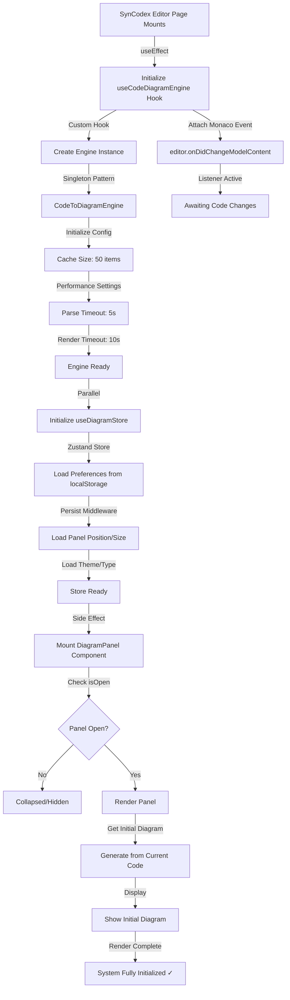

---

## 3. Diagram Type Switching Flow

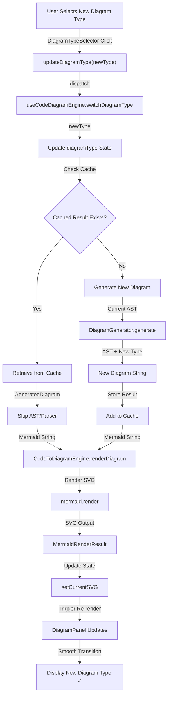

---

## 4. Cache Management & LRU Eviction

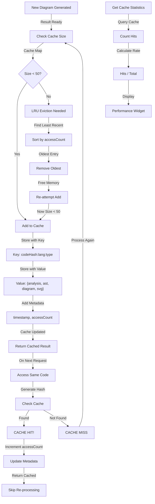

---

## 5. Error Handling & Recovery

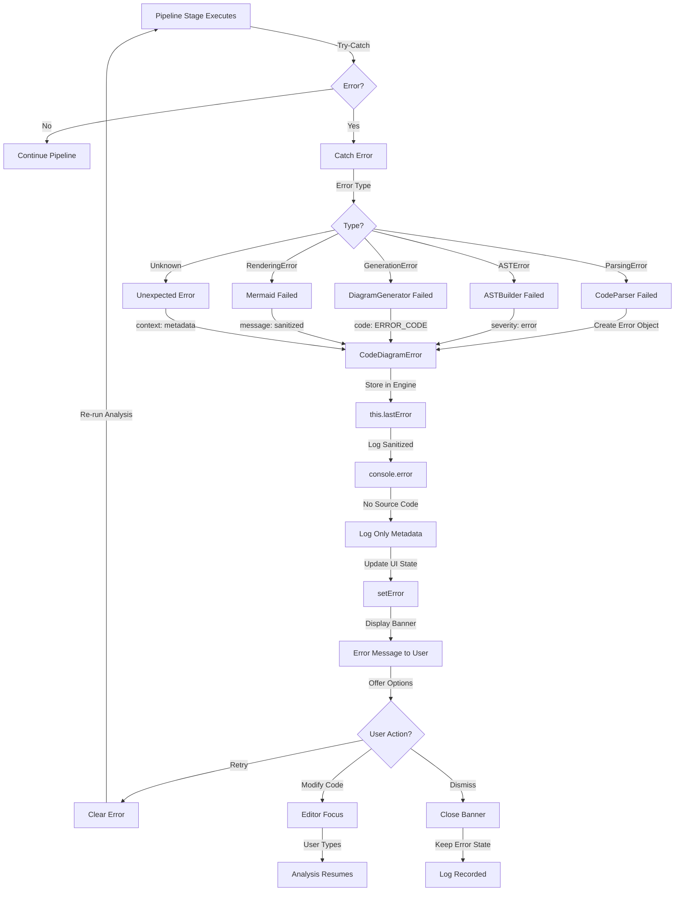

---

## 6. Language Detection Algorithm

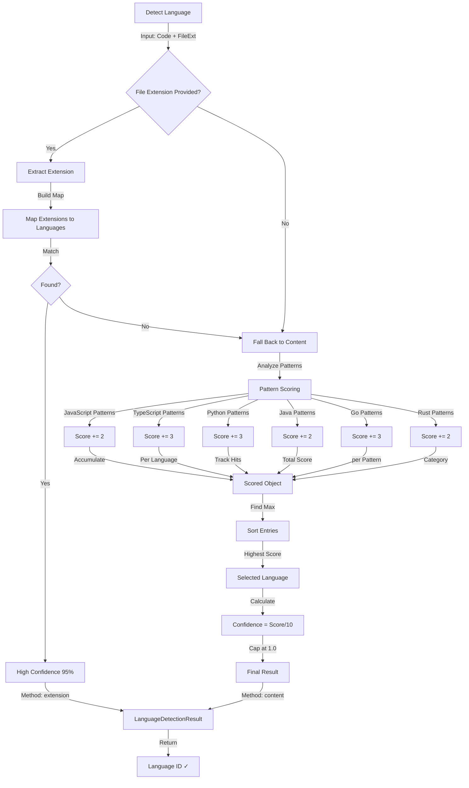

---

## 7. AST Building Process

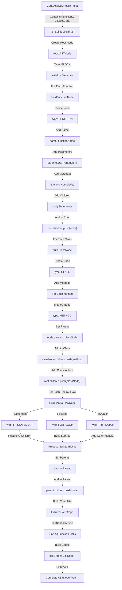

---

## 8. Mermaid Rendering Pipeline

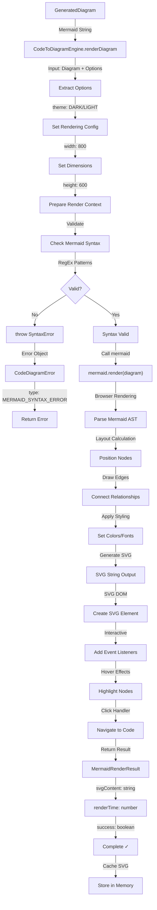

---

## 9. User Interaction: Node Selection & Code Linking

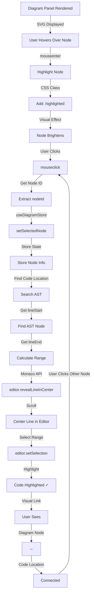

---

## 10. Export Diagram Flow

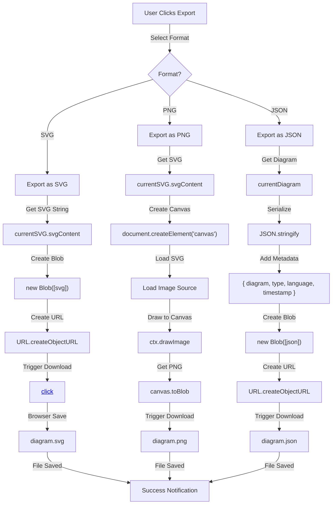

---

## 11. State Management Flow (Zustand Store)

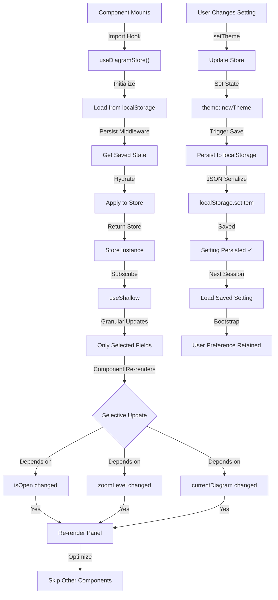

---

## 12. Performance Monitoring & Metrics

```mermaid
graph TD
    A["Pipeline Starts"] -->|performance.now()| B["Start Time"]
    
    B -->|Parser Step| C["Parser Start"]
    C -->|Parse Complete| D["Parser End"]
    D -->|Calculate| E["parsingTimeMs = End - Start"]
    
    E -->|AST Step| F["AST Builder Start"]
    F -->|Build Complete| G["AST Builder End"]
    G -->|Calculate| H["astBuildingTimeMs"]
    
    H -->|Generator Step| I["Generator Start"]
    I -->|Generate Complete| J["Generator End"]
    J -->|Calculate| K["diagramGenerationTimeMs"]
    
    K -->|Renderer Step| L["Renderer Start"]
    L -->|Render Complete| M["Renderer End"]
    M -->|Calculate| N["renderingTimeMs"]
    
    N -->|Total| O["totalTimeMs = Sum"]
    O -->|Check Cache| P{Cache Hit?}
    P -->|Yes| Q["cacheHit = true"]
    P -->|No| R["cacheHit = false"]
    
    Q -->|Memory| S["Get Memory Usage"]
    R -->|Memory| S
    S -->|performance.memory| T["memoryUsedMb"]
    T -->|Create Metrics| U["DiagramPerformanceMetrics"]
    
    U -->|Store| V["lastMetrics"]
    V -->|Display| W["Performance Widget"]
    W -->|Show User| X["Parse: 150ms | Render: 300ms"]
```

---

## 13. Browser Compatibility Check

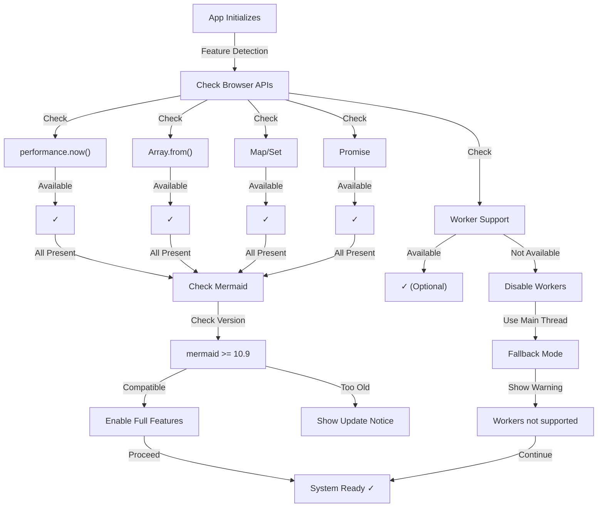

---

## 14. Collaborative Editing Integration (Yjs)

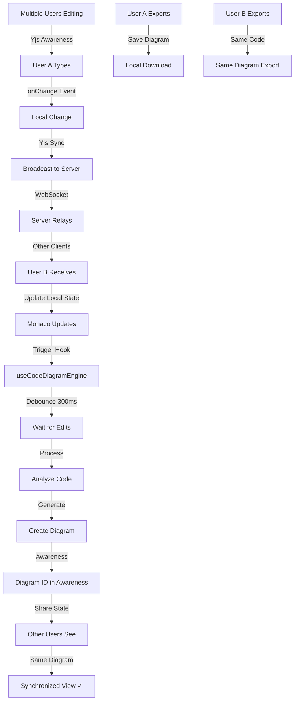

---

## 15. Memory Lifecycle & Cleanup

```mermaid
graph TD
    A["App Initialize"] -->|Memory| B["Engine Instance: ~5MB"]
    B -->|Cache| C["Empty: 0MB"]
    C -->|Ready| D["Total: 5MB"]
    
    E["First Diagram"] -->|Parse: 1MB| F["AST: 2MB"]
    F -->|Diagram: 0.5MB| G["SVG: 0.5MB"]
    G -->|Store in Cache| H["Total: 9MB"]
    
    I["Second Diagram"] -->|Different Code| J["Parse: 1MB"]
    J -->|AST: 2MB| K["Diagram: 0.5MB"]
    K -->|SVG: 0.5MB| L["Cache Item 2: 4MB"]
    L -->|Total: 13MB"]
    
    M["Continue..."] -->|Item 3| N["Total: 17MB"]
    N -->|Item 4| O["Total: 21MB"]
    O -->|Item 5| P["Total: 25MB"]
    P -->|...| Q["Item 50"]
    Q -->|Total: ~40MB"]
    
    R["Cache Full"] -->|New Item| S["LRU Eviction"]
    S -->|Remove Oldest| T["Free 4MB"]
    T -->|Add New| U["Stay at 40MB"]
    
    V["Browser Memory Pressure"] -->|Event| W["Clear Cache"]
    W -->|All Entries| X["0MB"]
    X -->|Keep Engine| Y["5MB Retained"]
    Y -->|Recovery| Z["Ready for Next"]
```

---

## Summary

These diagrams represent:

1. **Real-Time Update Pipeline**: Complete flow from typing to diagram display
2. **Component Lifecycle**: Initialization and mounting sequence
3. **Diagram Type Switching**: Changing diagram types efficiently
4. **Cache Management**: LRU eviction and hit/miss scenarios
5. **Error Handling**: Error detection, logging, and recovery
6. **Language Detection**: Multi-language detection algorithm
7. **AST Building**: Tree construction and relationship mapping
8. **Mermaid Rendering**: SVG generation pipeline
9. **User Interaction**: Node selection and code linking
10. **Export Functionality**: Multiple export format support
11. **State Management**: Zustand store with persistence
12. **Performance Monitoring**: Metrics collection and tracking
13. **Browser Compatibility**: Feature detection and fallbacks
14. **Collaborative Editing**: Yjs integration
15. **Memory Lifecycle**: Memory allocation and cleanup

---

**Document Version**: 2.0.0  
**Last Updated**: May 2026  
**Format**: Mermaid Diagram Language  
**Status**: ✅ Complete & Production Ready
